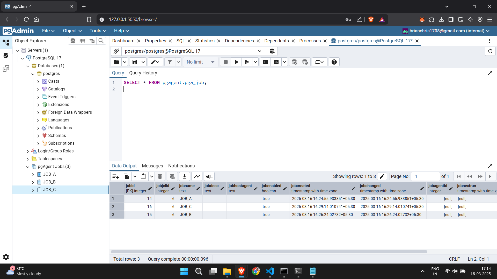
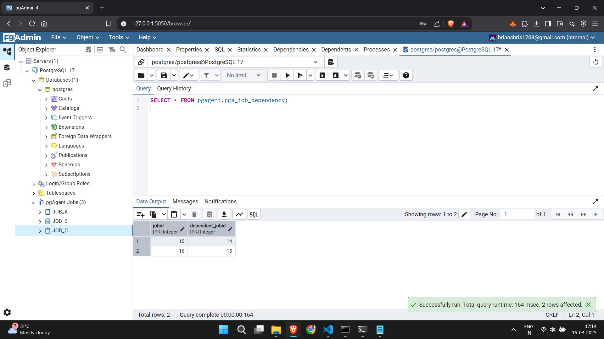
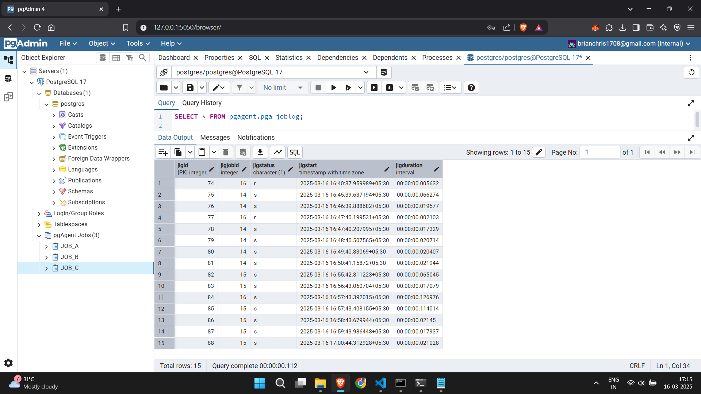
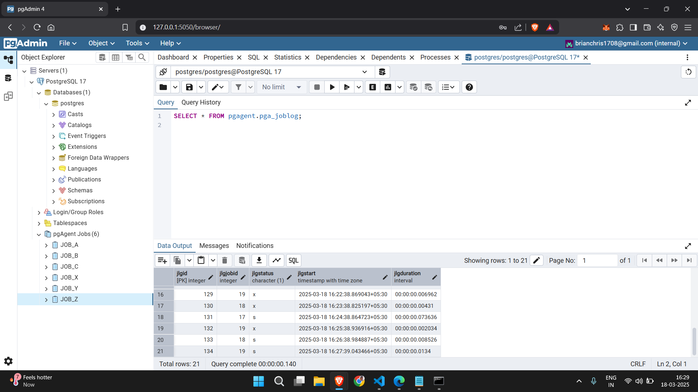
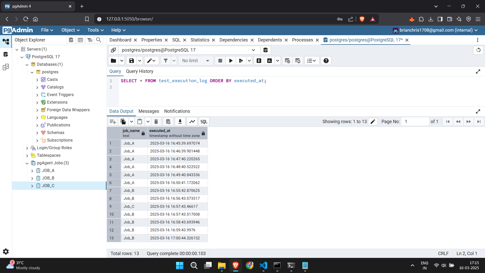
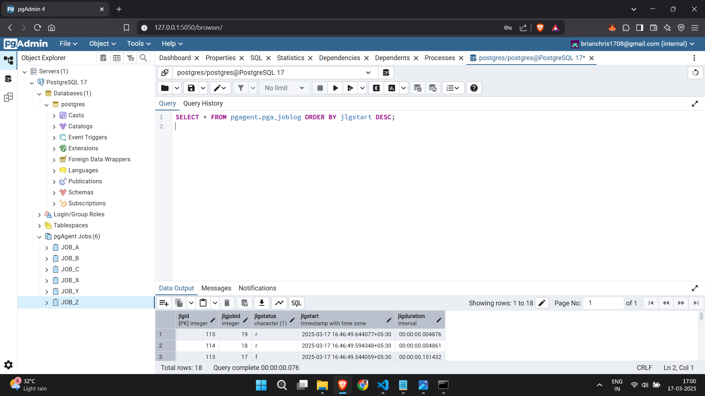
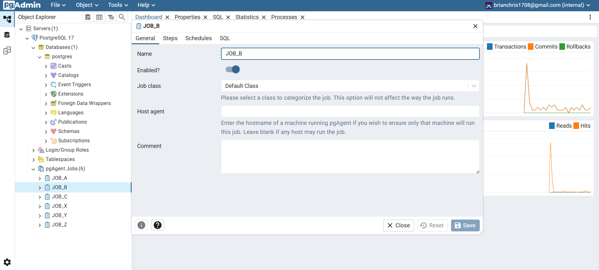
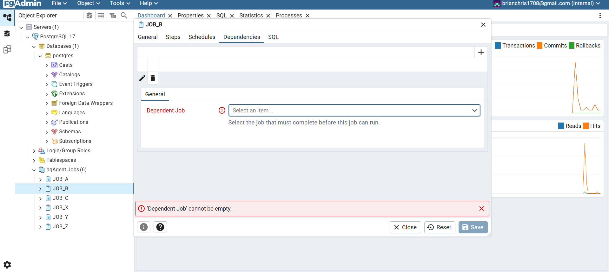
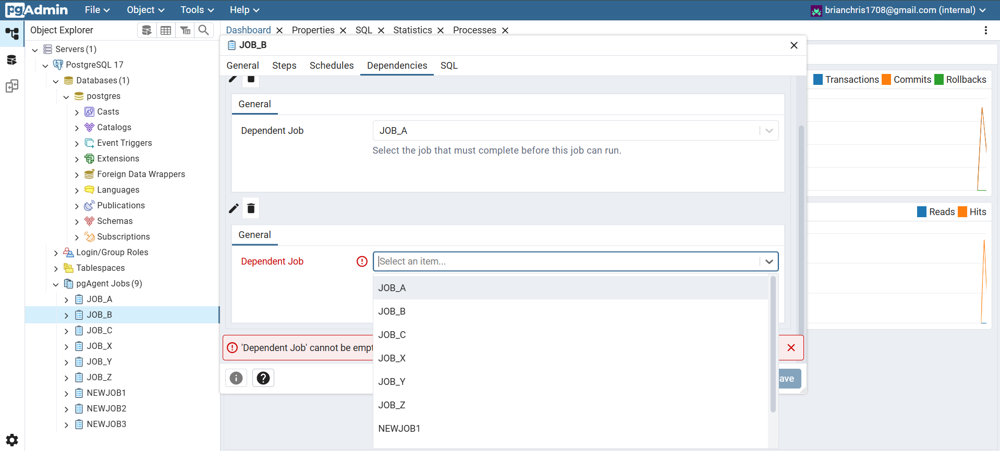

# 📸 Job Dependency Implementation - Proof of Execution

This document contains **screenshots** of SQL query outputs to **demonstrate** the correct working of the **Job Dependency feature**.

---

## **1️⃣ Checking Job Table (Before Execution)**
This query retrieves job details before execution.

```
SELECT * FROM pgagent.pga_job;
```

✅ **Expected Output:**  
Jobs should have valid `jobid`, `jobname`, and `jobnextrun` values.

📸 **Screenshot:**  



---

## **2️⃣ Checking Dependency Table**
Verifying the dependencies set for jobs.

```
SELECT * FROM pgagent.pga_job_dependency;
```

✅ **Expected Output:**  
Shows dependent jobs.

📸 **Screenshot:**  


---

## **3️⃣ Job Execution Log**
Checking job execution order.

```
SELECT * FROM pgagent.pga_joblog;
```

✅ **Expected Output:**  
- `Job_A` should execute first.
- `Job_B` should execute **after** `Job_A`.
- `Job_C` should **not** execute if `Job_B` fails.

📸 **Screenshot:**  

- `r` represents **not completed due to dependency constratint**.
- `s` represents **successfully completed execution**.

**Refined Job Status Entry**

- `x` represents **not completed due to dependency constraint**.
- `s` represents **successfully completed execution**.

- `Job_X (jobid:17)` is **independent**.
- `Job_Y (jobid:18)` **depends** on `Job_X (jobid:17)`.
- `Job_Z (jobid:19)` **depends** on `Job_Y (jobid:18)`.
---

## **4️⃣ Verifying Final States of the Test Table we created to see the entry of each job in the table**
Check of test_table `test_execution_log`.

```
SELECT * FROM test_execution_log ORDER BY executed_at;
```

✅ **Expected Output:**  
- `executed_at` should have value only **after actual execution**. So `Job C` should insert a value in table after both `Job A` and `Job B` has succesfully ran.

📸 **Screenshot:**  


---

## **5️⃣ Result of Failing a Job**
Now we have created 3 more jobs `Job X(jobid:17)`,`Job Y(jobid:18)` and `Job Z(jobid:19)` where job dependency is defined as `Job Y` is dependent on `Job X` and `Job Z` is dependent on `Job Y`.

For `Job X(jobid:17)` we modify the code in `STEP` part of scheduling where there is no table defined with name `failed_test_execution_log`

```
INSERT INTO failed_test_execution_log (job_name) VALUES ('Job_X');
```

Checking job execution order for the newly created jobs.
```
SELECT * FROM pgagent.pga_joblog ORDER BY jlgstart DESC;
```

✅ **Expected Output:**  
- `Job X` should have **failed** resulting in `Job Y` and `Job Z` to also **fail due to dependency**.

📸 **Screenshot:**  


- `r` represents **not completed due to dependency** but has made modification mentioned in the section [Go to Refined Job status entry](#3️⃣-job-execution-log).
- `f` represents **failed due to some internal issue**.

---

## **6️⃣ UI Changes**

We can now see a new tab `Dependency` while creating a job. Ensured that the `Dependent Job` cannot be empty if a dependency is added and there is no `Self Dependency`.

📸 **Screenshot:** 
- Old pgAdmin Job creation interface 


- New pgAdmin Job creation interface with proper constraint check


- New pgAdmin Job creation interface ensuring no self dependency


---

🎯 **Conclusion:**  
The Job Dependency feature is **working as expected** with **correct execution order**.

---
